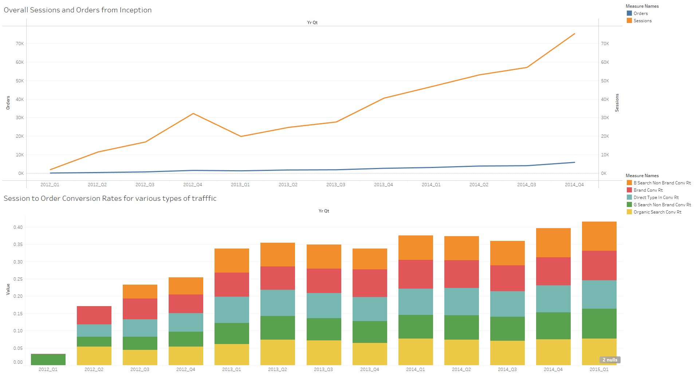

## Visualizations

General trend of overall sessions and order volume from inception has increased. All types of traffic sources have contributed significantly at every quarter.

Overall session to order volume has shown significant increase, but has dropped during 2013_Q4 to 2014_Q3, to inspect this decrease, will perform further analysis and upload the results.

Overall Margin is following Revenue line but falling behind indicating at scale, products are giving effective margin which maximizes profits
Product wise revenue growth has significant contribution from their main product **Mr. Fuzzy** while other products have picked up the pace

